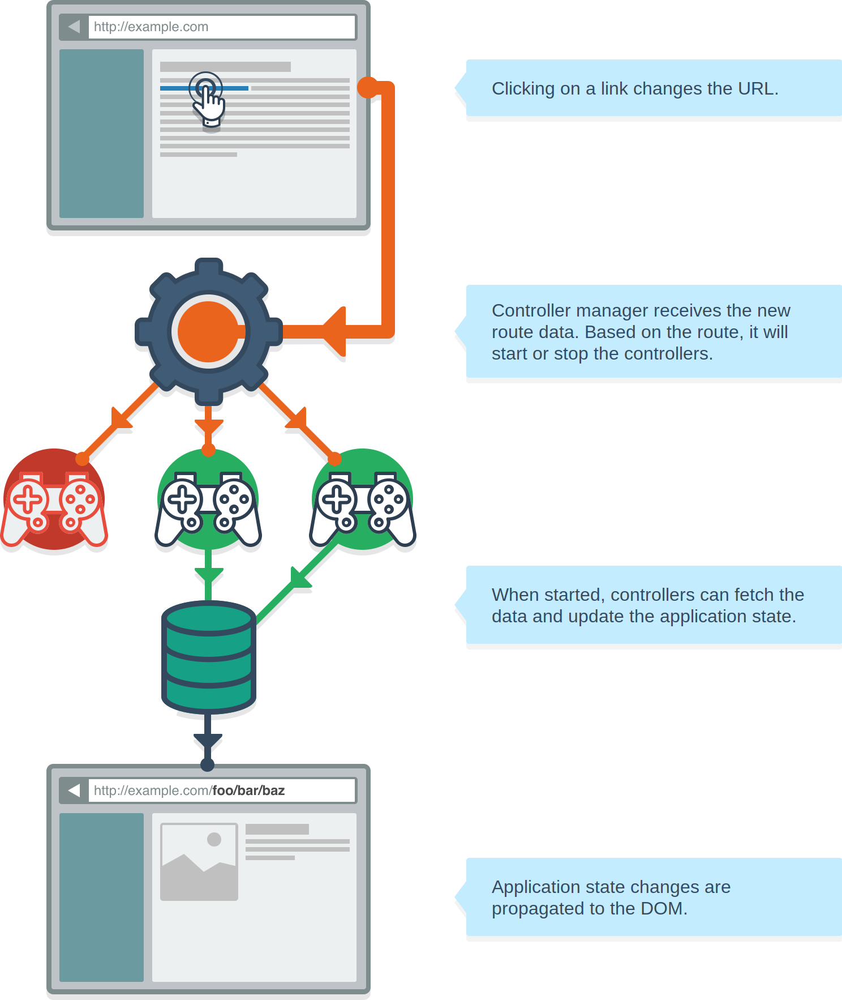

# Controllers

Controllers in Keechma react to route changes and implement any code that has side effects.

- Controllers make AJAX requests.
- Controllers mutate application state
- Controllers can connect to web sockets, etc.

Anything that has side effects goes to controllers. This is a place where you put all that ugly stuff that actually runs the application and they let the rest of the app to be beautiful and pure.

Controllers are subjects to the route. They have a strict lifecycle which depends on the current route. Contrary to the controllers in the other frameworks, controllers in Keechma operate on the route, instead of the UI components.

I know it seems confusing, but I’ll try to make it clearer soon. Before that I want to talk about application state, how that state gets built and what are the consequences (which will never be the same).

Every frontend app has to take care of it’s state, and there are multiple ways how you can enter that state. In Keechma state is strictly derived from the URL, but we still have the following situations:

1. User reloads the page and lands to the page with the URL ‘/news/1"
2. User goes from the route "/news" to route "/news/1"
3. User is on the route "/news/1" and is posting a comment

These situations are something that you will have to handle in every app you write. There are also different UI layouts that can affect how you react to those routes:

- You could have a "page" based app and transition from "/news" to "/news/1" basically replaces the whole page (except for the menu, and the rest of the chrome)
- You could have a master - detail layout where you show a list of news in one panel and a detail view of the news with the id 1 in the detail panel
- Commenting on the news could take you to a new page
- Commenting on the news could append the comment to the list of the comments

Anyway, this is just a subset of possible scenarios. You need a system that scales across all of them.

You need a system that allows you to do the following:

- When user transitions from "/news" to "/news/1" replace everything on the screen with the news with id 1 but, don’t load anything, you already have it in memory.
- When user refreshes on the "/news/1" page and you use master - detail layout, load both the news list and the news with id 1 and show them both on the screen
- When user posts a comment and it’s saved in the DB, send him to the "Thank you page"
- When user posts a comment and it’s saved in the DB, show that comment on top of the existing comments

It gets complicated fast.

This part of Keechma was the hardest to get right, but I believe I have a solution.

Controllers in Keechma are `clojure` records that implement the `keechma.controller/IController` protocol. This protocol implements the following methods (among others):

- `params` - based on the route params, return params needed for this controller to run or `nil`
- `start` - synchronously mutate App DB when controller is started
- `stop` - synchronously mutate App DB when controller is stopped
- `handler` - function that can asynchronously react to commands

## Controller Lifecycle

With these methods defined, we can make a system that works. Controllers are run by routes. Every time when the URL changes Keechma starts the cycle. This cycle is the core of how applications are built with Keechma.

When URL changes Keechma will do the following:

1. It will call `params` function of all registered controllers
2. It will compare returned value to the last returned value (from the previous cycle)
3. Based on the result it will do the following:
  1. If previous value was `nil` and current value is `nil` it will do nothing
  2. If previous value was `nil` and current value is not `nil` it will start the controller
  3. If previous value was not `nil` and current value is `nil` it will stop the controller
  4. If previous value was not `nil` and current value is not `nil` but those values are same it will do nothing
  5. If previous value was not `nil` and current value is not `nil` but those values are different it will restart the controller

Important thing to mention is that `params` function is a way for the controller to express interest in the current state and do something with it.

